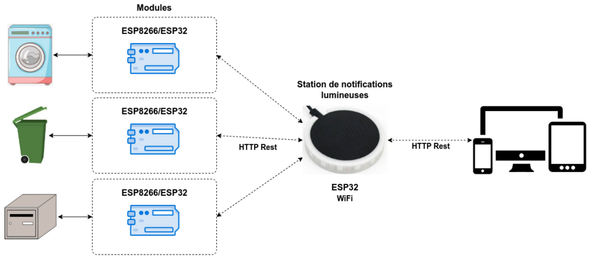
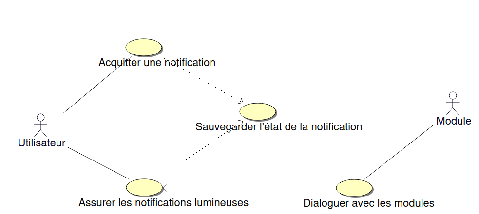
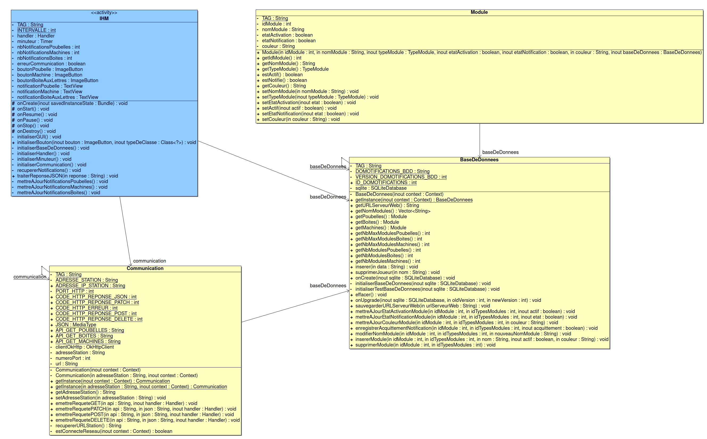
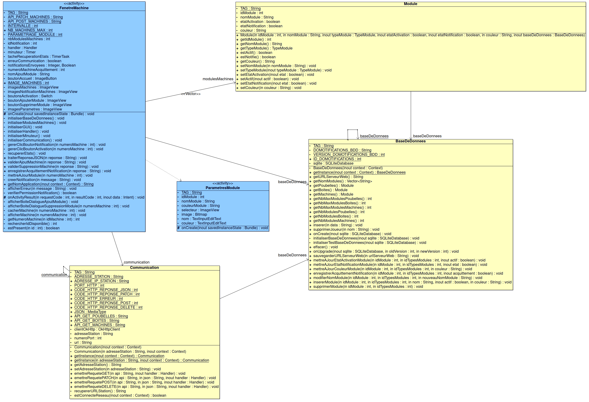
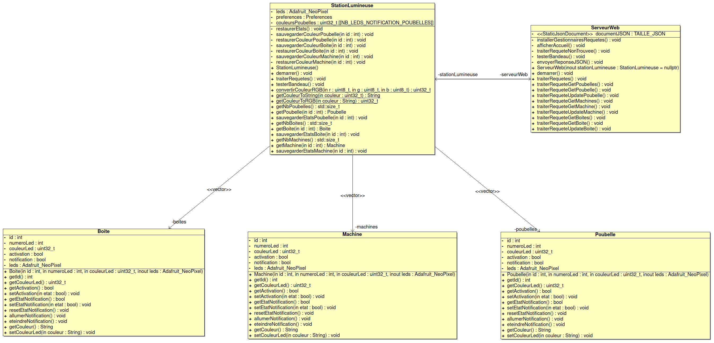
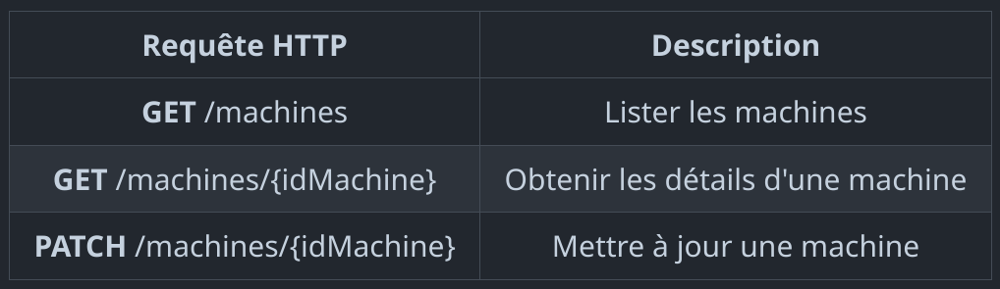
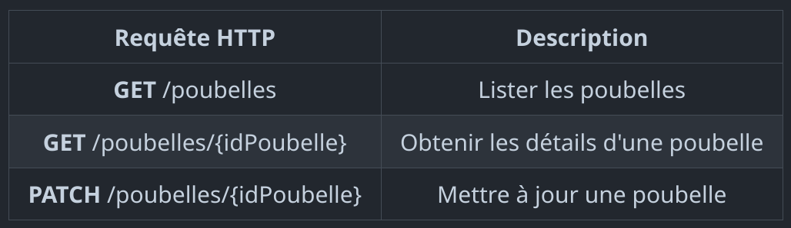
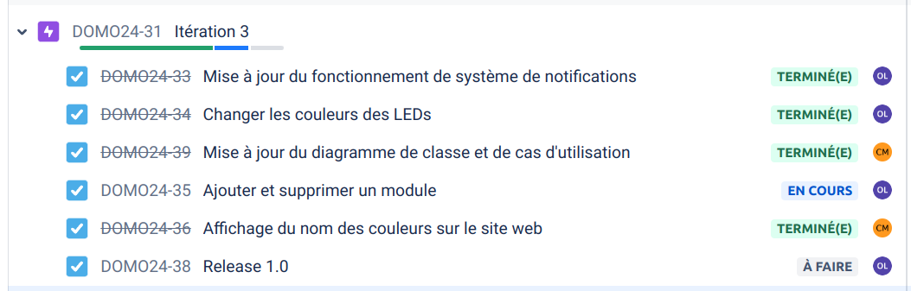
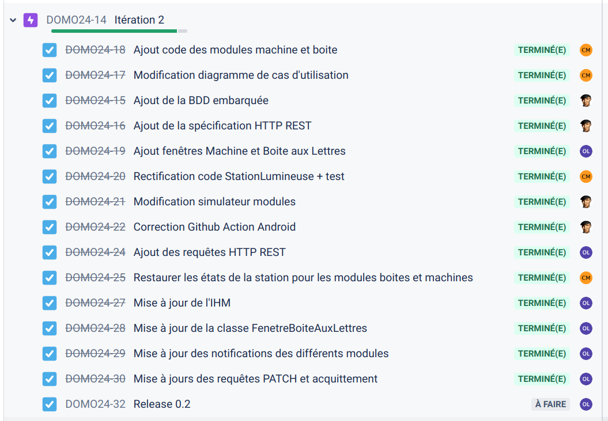
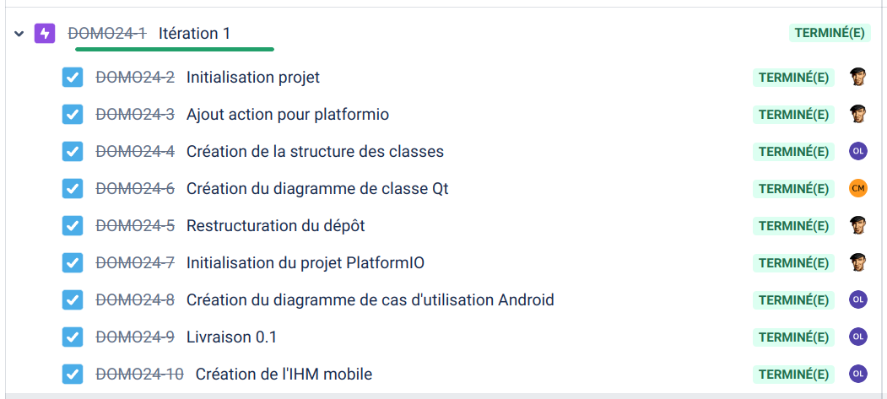

  

  

# Le projet domotifications 2024

- [Le projet domotifications 2024](#le-projet-domotifications-2024)
  - [Présentation](#présentation)
  - [Fonctionnalités](#fonctionnalités)
  - [Screenshots](#screenshots)
  - [Diagramme de classes](#diagramme-de-classes)
  - [Protocole](#protocole)
  - [Historique des versions](#historique-des-versions)
  - [Documentation du code](#documentation-du-code)
  - [Auteurs](#auteurs)

---

## Présentation

Le système **domotifications** doit permettre de notifier visuellement des évènements domotiques (quand et quelle poubelle sortir, quand est-ce qu’un colis a été livré dans la boîte aux lettres et quand est-ce qu’une des machines à laver ou sécher le linge a terminé, ...).

La station de notifications lumineuses est composée d’un bandeau circulaire à leds piloté par un ESP32. Celui-ci est découpé en trois groupes distincts pour les notifications :

- en vert : la notification d’une machine terminée (le système peut gérer jusqu’à _n_ machines individuellement),
- en rouge : la présence d’un colis dans la boîte aux lettres,
- en rouge/bleu/vert/gris/jaune : la notification d'une poubelle de tri à sortir.

## Fonctionnalités

- Application Android

| Fonctionnalité                      | OUI | NON |
| ----------------------------------- | :-: | :-: |
| Visualiser une notification         |  X  |     |
| Acquitter une notification          |  X  |     |
| Activer/désactiver un module        |  X  |     |
| Dialoguer avec la station lumineuse |  X  |     |
| Configurer le système               |  X  |     |

- Station lumineuse

| Fonctionnalité               | OUI | NON |
| ---------------------------- | :-: | :-: |
| Visualiser une notification  |  X  |     |
| Acquitter une notification   |  X  |     |
| Activer/désactiver un module |  X  |     |
| Traiter les requêtes HTTP    |  X  |     |
| Configurer la station        |     |  X  |

## Screenshots

## Diagramme de classes

- Application Android

- Station lumineuse (ESP32)

## Protocole

cf. [Spécification API HTTP REST](./specifications-openapi/README.md)

## Historique des versions

- 1.0

- 0.2

- 0.1

## Documentation du code

https://btssn-lasalle-84.github.io/domotifications-2024/

## Auteurs

- Étudiant IR (Android) : LATYAOUI Othman <<othmanlatyaoui.pro@gmail.com>>
- Étudiant IR (ESP32) : MOUTTE Corentin <<corentinmoutte@gmail.com>>

---
©️ LaSalle Avignon 2024
