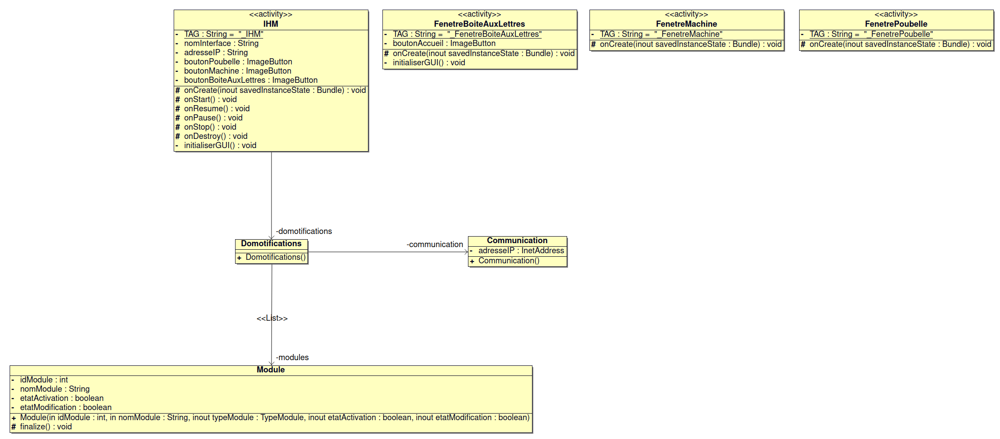
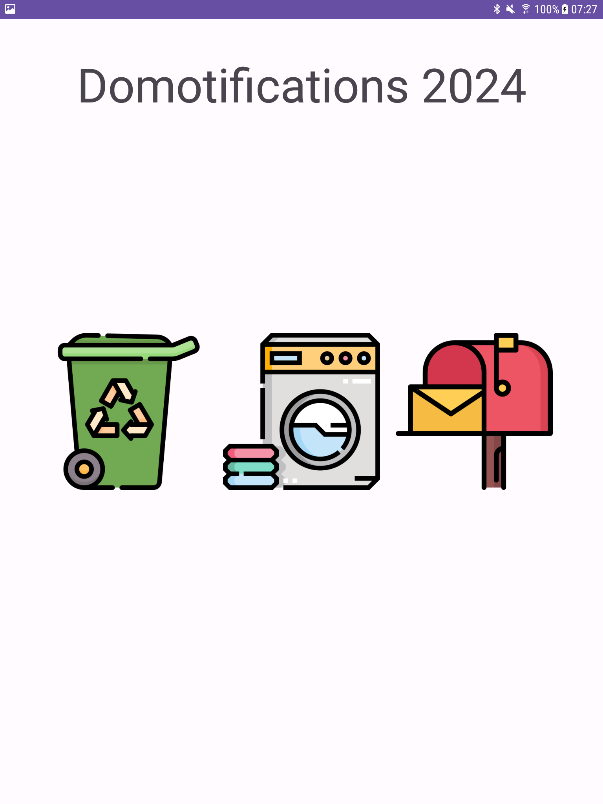
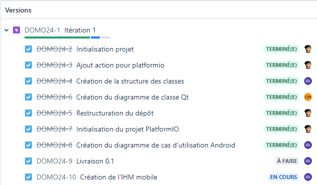

  

  

# Le projet domotifications 2024

- [Le projet domotifications 2024](#le-projet-domotifications-2024)
  - [Présentation](#présentation)
  - [Fonctionnalités](#fonctionnalités)
  - [Documentation du code](#documentation-du-code)
  - [Diagramme de classes](#diagramme-de-classes)
  - [Protocole](#protocole)
  - [Screenshots](#screenshots)
  - [Historique des versions](#historique-des-versions)
  - [Auteurs](#auteurs)

---

## Présentation

Le système **domotifications** doit permettre de notifier visuellement des évènements domotiques (quand et quelle poubelle sortir, quand est-ce qu’un colis a été livré dans la boîte aux lettres et quand est-ce qu’une des machines à laver ou sécher le linge a terminé, ...).

La station de notifications lumineuses est composée d’un bandeau circulaire à leds piloté par un ESP32. Celui-ci est découpé en trois groupes distincts pour les notifications :

- en vert : la notification d’une machine terminée (le système peut gérer jusqu’à _n_ machines individuellement),
- en rouge : la présence d’un colis dans la boîte aux lettres,
- en rouge/bleu/vert/gris/jaune : la notification d'une poubelle de tri à sortir.

## Fonctionnalités

| Fonctionnalité                         | OUI  | NON |
|----------------------------------------|:----:|:---:|
| Application mobile fonctionnelle       |  X   |     |
| Afficher une notification              |      |  X  |
| Acquitter une notification             |      |  X  |
| Dialoguer avec l'IHM                   |      |  X  |
| Activer/Désactiver un module           |      |  X  |

## Documentation du code

https://btssn-lasalle-84.github.io/domotifications-2024/

## Diagramme de classes

## Protocole

## Screenshots

- Version 0.1 (Android)

## Historique des versions

- 0.1

## Auteurs

- Étudiant IR (Android) : LATYAOUI Othman <<othmanlatyaoui.pro@gmail.com>>
- Étudiant IR (ESP32) : MOUTTE Corentin <<corentinmoutte@gmail.com>>

---
©️ LaSalle Avignon 2024
